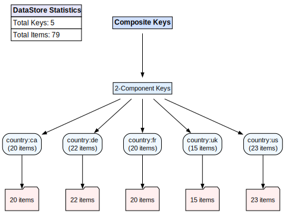

# MatrixSearch: Composite Key Data Store

MatrixSearch is a simple, generic in-memory data store library written in Go. It uses composite indexing to quickly search through your data. With MatrixSearch, you can insert, update, delete, and query any type of struct by automatically generating index keys from your struct's fields.

## What It Is

MatrixSearch lets you filter through your data on multiple dimensions. Whether you have a list of cars, fruits, proxies, or any other structured data, MatrixSearch will allow you to efficiently filter your data at every level of your struct. Think of it as a tool for **multi-field data filtering**.

<div align="center">
  
</div>

## How It Works

- **Composite Indexing:**  
  The library generates combinations of keys from your data, using either a custom indexer or automatically via reflection with `text:"<tag>"` annotations. These composite keys enable you to search by any combination of fields.

- **Flexible Queries:**  
  You can perform both full key matches or partial queries. For instance, you can query by a single field or by multiple fields such as model, year, and color all at once.

- **Random Result Retrieval:**  
  The `SearchRandom` function returns one random item that matches your query, which is useful when you only need a sample from a large dataset.


## Quick Start

1. **Install MatrixSearch:**

   ```bash
   go get github.com/xvertile/matrixsearch
   ```

2. **Simple Example:**

   ```go
   package main

   import (
       "fmt"
       "github.com/xvertile/matrixsearch"
   )

   type Fruit struct {
       Name  string  `text:"name"`
       Color string  `text:"color"`
       Price float64 `text:"price"`
   }

   // Custom indexer creates composite keys from the struct.
   func fruitIndexer(f Fruit) []string {
       return []string{"name:" + f.Name, "color:" + f.Color}
   }

   func main() {
       ds := matrixsearch.NewDataStore(func(f Fruit) string { return f.Name }, fruitIndexer)
       apple := Fruit{Name: "Apple", Color: "Red", Price: 1.5}
       ds.Insert(apple)

       query := "name:Apple:color:Red"
       results := ds.Search(query)
       fmt.Println("Found fruits:", results)
   }
   ```
   
Please refer to the [examples](examples) directory for more detailed examples.

## Benchmark Highlights

Below are some sample benchmark results that illustrate MatrixSearch's performance on various datasets:

| Test                     | Size      | Time per Operation |
|--------------------------|-----------|--------------------|
| Proxy Search Random      | 10,000    | ~72 ns/op          |
| Proxy Search Random      | 100,000   | ~83 ns/op          |
| Proxy Search Random      | 1,000,000 | ~143 ns/op         |
| Fruit Search Random      | 10,000    | ~44 ns/op          |
| Fruit Search Random      | 100,000   | ~47 ns/op          |
| Fruit Search Random      | 1,000,000 | ~37 ns/op          |
| Car Search Random        | 10,000    | ~37 ns/op          |
| Car Search Random        | 100,000   | ~44 ns/op          |
| Car Search Random        | 1,000,000 | ~38 ns/op          |

These numbers show that MatrixSearch scales well, making it a practical choice for in-memory multi-field data filtering.

Raw benchmark results can be found in the `benchmark` directory.
